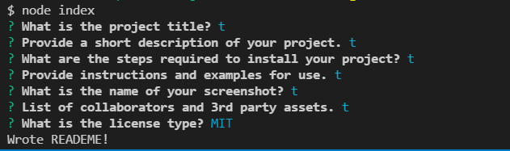

  # README Generator

  

  ## Video Link
  https://watch.screencastify.com/v/2zNyMpcXzTepQhALmpAm
  
  ## Description
  This project was designed to make creating a README quick and easy. With a few simple questions using node.js you can create a professional README.
  
  ## Installation
  To run this application you need to have Node.js, NPM, and Inquirer.js. 1️⃣ Live URL: https://christopherponzio.github.io/readme-generator 2️⃣ GitHub: https://github.com/ChristopherPonzio/readme-generator.
  
  ## Usage
  To use the README Generator you need to have Node.js, NPM, and Inquirer.js installed. To use the screenshot feature you need to have an images folder inside of an assets folder. I have added a screenshot demonstrating the questions you will be asked when running the README Generator.
  

  ## Credits
  1️⃣Michelle Blackwell github: https://github/Mblackwellgca 2️⃣ https://stackoverflow.com 3️⃣ https://w3schools.com 4️⃣ https://choosealicense.com 5️⃣ https://img.shields.io
  
  ## License
      Licensed under the MIT license.
  https://choosealicense.com/licenses/mit
  
